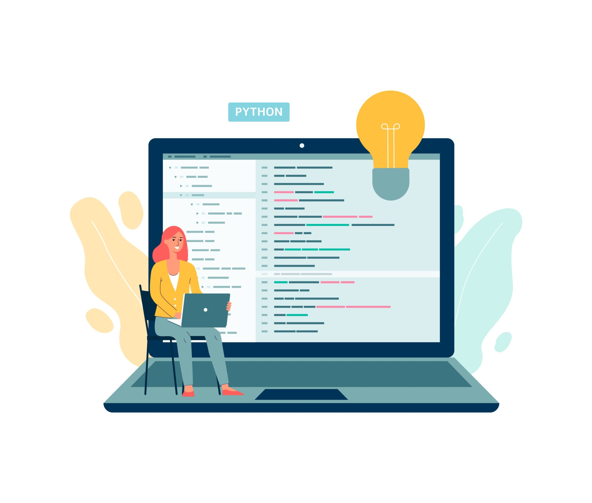

# Welcome to Python Programming

{ .homepage-image }

Python is a popular programming language used to create websites, games, apps, data tools and artificial intelligence projects. It is known for being clear to read, powerful to use and a great first language for learning how programming works.

As you learn Python, you will practise giving instructions to the computer, storing information, making decisions and solving problems step by step.
